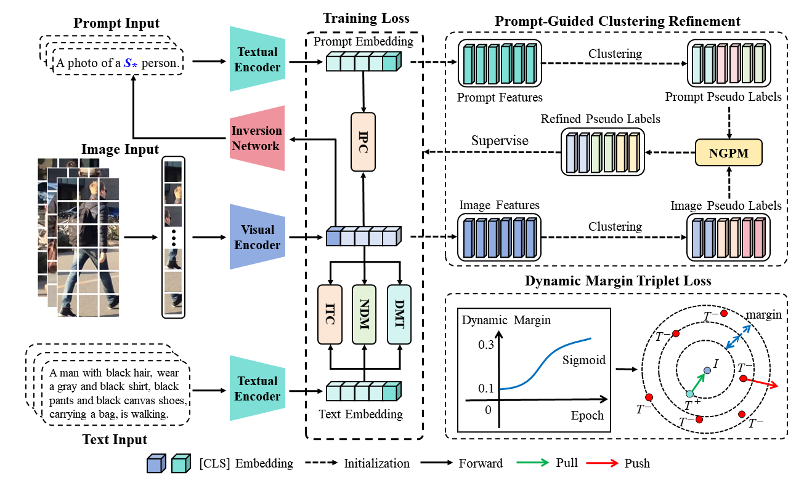

# **Consensus Labelling: Prompt-Guided Clustering Refinement for Weakly Supervised Text-based Person Re-Identification**

## Authors: Chengji Wang，Weizhi Nie, Hongbo Zhang, Hao Sun, and Mang Ye

## Highlights



## Usage

### Prepare Datasets
Download the CUHK-PEDES dataset from [here](https://github.com/ShuangLI59/Person-Search-with-Natural-Language-Description), ICFG-PEDES dataset from [here](https://github.com/zifyloo/SSAN) and RSTPReid dataset form [here](https://github.com/NjtechCVLab/RSTPReid-Dataset)

Organize them in `your dataset root dir` folder as follows:
```
|-- your dataset root dir/
|   |-- <CUHK-PEDES>/
|       |-- imgs
|            |-- cam_a
|            |-- cam_b
|            |-- ...
|       |-- reid_raw.json
|
|   |-- <ICFG-PEDES>/
|       |-- imgs
|            |-- test
|            |-- train 
|       |-- ICFG_PEDES.json
|
|   |-- <RSTPReid>/
|       |-- imgs
|       |-- data_captions.json
```

## Training

```python
python train.py \
--name icpg \
--img_aug \
--batch_size 64 \
--MLM \
--loss_names 'fcm+ccm+ndm+dmt' \
--dataset_name 'CUHK-PEDES' \
--num_epoch 60
```

## Testing

```python
python test.py --config_file 'path/to/model_dir/configs.yaml'
```
